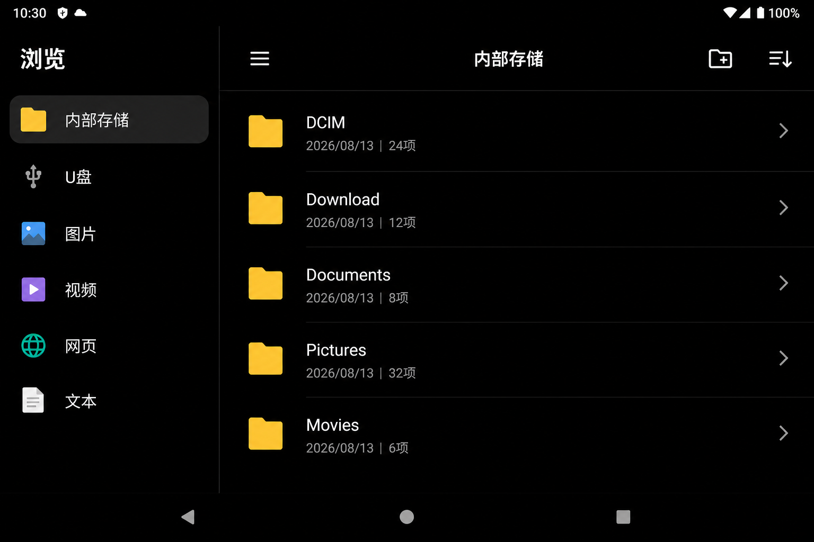
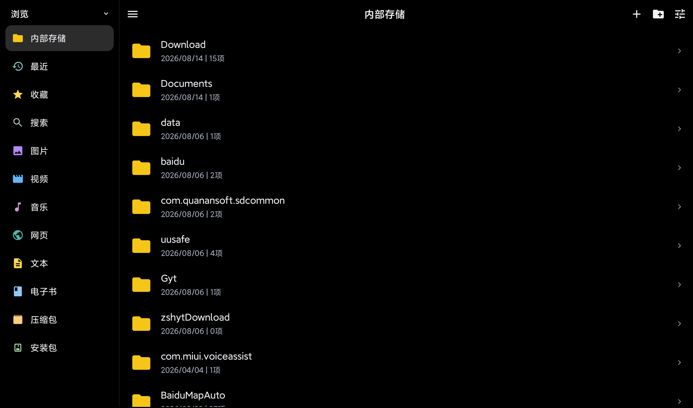
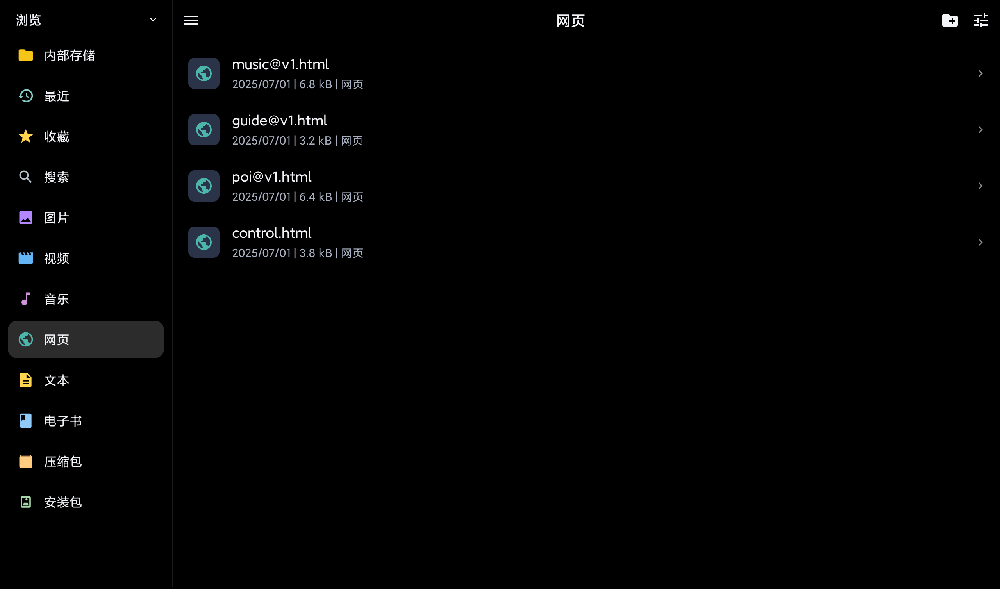

# 媒体中心

一个功能强大，把手机、平板、电视和 U 盘里的照片、视频、音乐、本地网页、文本和电子书，收进一个干净的本地浏览器。

不登录，不上云，不追踪。插上 U 盘就能看；电视遥控器也能用。

<p align="center">
  <a href="https://github.com/cheng2016/MediaCenter/releases/latest/download/MediaCenter-1.0.2.apk">
    
  </a>
  &nbsp;
  <a href="https://github.com/cheng2016/MediaCenter/releases/latest">
    
  </a>
</p>

<p align="center">
  <a href="https://github.com/cheng2016/MediaCenter/releases/latest/download/MediaCenter-1.0.2.apk"><b>立即下载 APK</b></a>
  · Android 7.0+
  · 手机 / 平板 / 电视
</p>

<p align="center">
  
</p>

<p align="center">
  
  &nbsp;
  
</p>

<p align="center">
  <sub>左侧菜单 · 图片按日期分组 · 文件显示日期、大小和类型</sub>
</p>

---

## 为什么用它

系统相册只爱图片和视频。U 盘里的 `index.html`、说明书、日志、离线教程，常常要换好几个 App，还可能被系统浏览器乱打开。

媒体中心按文件夹把东西摊开，点什么就用对应的查看器打开。

## 左侧菜单

内部存储、U 盘、最近、收藏、搜索、图片、视频、音乐、网页、文本、电子书、压缩包、安装包。

- **最近 / 收藏**：文件被删或 U 盘拔掉后会灰掉并标「已失效」，点一下会从列表清掉
- **搜索**：按文件名过滤已索引的文件，搜索框会标明「只搜已索引的文件」；进入文件夹后也可以搜当前目录
- **收藏**：长按文件（电视上按菜单键）打开菜单，可收藏或取消

## 打开方式

| 类型 | 打开方式 |
| --- | --- |
| 图片 | 全屏缩放，左右滑切换 |
| 视频 | 内置播放器，下次从上次看到的位置继续 |
| 音乐 | 封面、曲名、进度条、播放/暂停、上一首 / 下一首，记住进度 |
| 网页 `.html` / `.htm` | 内置浏览器，同目录 CSS / 图片 / JS 一起加载 |
| PDF | 应用内翻页阅读，记住页码 |
| 电子书 `.epub` | 目录跳转、原书 CSS / 夜间、划线标注，记住章节和滚动位置 |
| 文本 `.txt` | 默认预览，点编辑后才能改，离开会保存 |
| 其它文本 `.md` / `.json` / `.log` … | 只读预览，大文件自动截断 |
| ZIP | 应用内浏览、解压后打开里面的文件 |
| rar / 7z 等 | 列表上标明「暂不支持」，不会假装能打开 |
| 安装包 `.apk` | 调用系统安装（需允许未知应用） |
| 其它文件 | 交给系统里能打开它的应用 |

## 文件操作

在内部存储或 U 盘的当前目录里：

- **+**：新建文件夹、新建文本（`.txt`）
- **长按**（电视：菜单键）：收藏、重命名、移动到子文件夹、删除

需要已授予全部文件访问权限。删除不可恢复。

## 适合谁

- 把资料、离线网页、教程拷进 U 盘，插到电视或平板上直接看
- 不想为了看几个本地 HTML 再装一套浏览器
- 需要一个不联网也能用的私人媒体柜

## 怎么用

1. [下载 APK](https://github.com/cheng2016/MediaCenter/releases/latest/download/MediaCenter-1.0.2.apk) 并安装（需允许未知来源）
2. 打开后授予 **全部文件访问**，才能看到网页、文本和 U 盘里的全部文件
3. 左侧选「内部存储」或 U 盘，进入文件夹浏览
4. 点网页文件，会用应用内置页面打开，返回键回到刚才的列表

电视：上/下切换左侧菜单，确认进入，右键跳到文件列表，左键回到菜单。长按或菜单键打开文件操作。

## 下载

安装包放在 [GitHub Releases](https://github.com/cheng2016/MediaCenter/releases/latest)，不进源码仓库。

- 最新包：[MediaCenter-1.0.2.apk](https://github.com/cheng2016/MediaCenter/releases/latest/download/MediaCenter-1.0.2.apk)
- 历史版本：https://github.com/cheng2016/MediaCenter/releases

## 自己编译

```bash
git clone https://github.com/cheng2016/MediaCenter.git
cd MediaCenter
./gradlew :app:assembleDebug
```

产物在 `app/build/outputs/apk/debug/`。

## 许可

源码以仓库为准。欢迎 Issue / PR。
